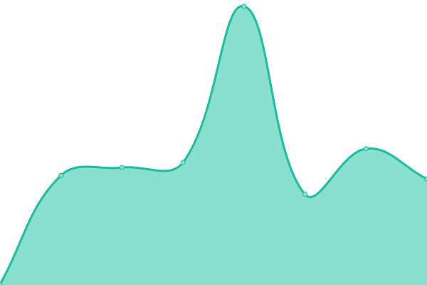

# [📈 Live Status](https://tool.oreo.life): <!--live status--> **🟩 All systems operational**

This repository contains the open-source uptime monitor and status page for [Aolin](https://oreo.life), powered by [Upptime](https://github.com/upptime/upptime).

With [Upptime](https://upptime.js.org), you can get your own unlimited and free uptime monitor and status page, powered entirely by a GitHub repository. We use [Issues](https://github.com/Oreoxmt/status-page/issues) as incident reports, [Actions](https://github.com/Oreoxmt/status-page/actions) as uptime monitors, and [Pages](https://tool.oreo.life) for the status page.

<!--start: status pages-->
<!-- This summary is generated by Upptime (https://github.com/upptime/upptime) -->
<!-- Do not edit this manually, your changes will be overwritten -->
<!-- prettier-ignore -->
| URL | Status | History | Response Time | Uptime |
| --- | ------ | ------- | ------------- | ------ |
|  [Working Day Calculator](https://tool.oreo.life/workcalc/) | 🟩 Up | [working-day-calculator.yml](https://github.com/Oreoxmt/status-page/commits/HEAD/history/working-day-calculator.yml) | 

 747ms
     
 | 

<a href="https://Oreoxmt.github.io/status-page/history/working-day-calculator">100.00%</a>
    

|  [Holiday Announcement Parser](https://tool.oreo.life/holiparse/) | 🟩 Up | [holiday-announcement-parser.yml](https://github.com/Oreoxmt/status-page/commits/HEAD/history/holiday-announcement-parser.yml) | 

 381ms
     
 | 

<a href="https://Oreoxmt.github.io/status-page/history/holiday-announcement-parser">100.00%</a>
    

|  [Automatic Release Scheduler](https://tool.oreo.life/autosched/) | 🟩 Up | [automatic-release-scheduler.yml](https://github.com/Oreoxmt/status-page/commits/HEAD/history/automatic-release-scheduler.yml) | 

 313ms
     
 | 

<a href="https://Oreoxmt.github.io/status-page/history/automatic-release-scheduler">100.00%</a>
    

<!--end: status pages-->

[**Visit our status website →**](https://tool.oreo.life)

## 📄 License

- Powered by: [Upptime](https://github.com/upptime/upptime)
- Code: [MIT](./LICENSE) © [Anand Chowdhary](https://anandchowdhary.com), supported by [Pabio](https://pabio.com)
- Data in the `./history` directory: [Open Database License](https://opendatacommons.org/licenses/odbl/1-0/)
